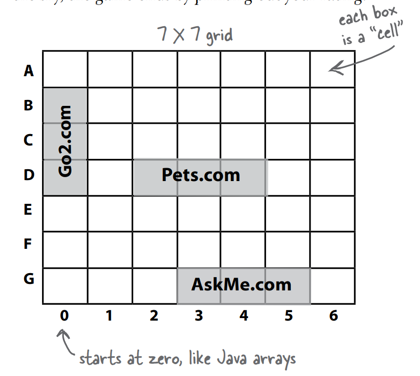

# Battle Ship Game

## **Goal:**

Sink all of the computer’s Dot Coms in the fewest number of guesses. You’re given a rating or level, based on how well you perform.

## **Setup:**

When the game program is launched, the computer places three Dot Coms on a virtual 7 x 7 grid. When that’s complete, the game asks for your first guess.

## **How you play :**

The computer will prompt you to enter a guess (a cell), that you’ll type at the command-line as “A3”, “C5”, etc.). In response to your guess, you’ll see a result at the command-line, either “Hit”, “Miss”, or “You sunk Pets.com” (or whatever the lucky Dot Com of the day is). When you’ve sent all three Dot Coms to that big 404 in the sky, the game ends by printing out your rating



## **Implementation**

### [`DotComBust.java`](DotComBust.java) : Main Class

```java
package SinkDotComGame;

import java.util.ArrayList;

public class DotComBust {
    GameHelper helper = new GameHelper();
    ArrayList<DotCom> dotComList = new ArrayList<DotCom>();
    int numOfGuesses = 0;

    private void setUpGame(){
        //Make three dot.com objects and name them
        DotCom one = new DotCom();
        one.setName("Pets.com");
        DotCom two = new DotCom();
        two.setName("Toys.com");
        DotCom three = new DotCom();
        three.setName("Go2.com");

        //Add the objects to the list
        dotComList.add(one);
        dotComList.add(two);
        dotComList.add(three);

        //Instructions for the user
        System.out.println("Your goal is to sink three dot coms.");
        System.out.println("Pets.com, Toys.com, Go2.com");
        System.out.println("Try to sink them all in the fewest number of guesses");
        
        //Place dotCom objects int the list
        for (DotCom obj : dotComList){
            ArrayList<String> newLocation = helper.placeDotCom(3);
            obj.setLocationCells(newLocation);
        }
    }

    private void startPlaying(){
        while(!dotComList.isEmpty()){
            String userGuess = helper.getUserInput("Enter a Guess");
            checkUserGuess(userGuess);
        }
        finishGame();
    }

    private void checkUserGuess(String userGuess){
        numOfGuesses++;
        String result = "Miss";

        for (DotCom obj : dotComList){
            result = obj.checkYourself(userGuess);
            if (result.equals("Hit")){
                break;
            }
            if (result.equals("Kill")){
                dotComList.remove(obj);
                break;
            }
        }
        System.out.println(result);

    }

    private void finishGame() {
        System.out.println("All Dot Coms are dead! Your stock is now worthless.");
        if (numOfGuesses <= 18) {
        System.out.println("It only took you “ + numOfGuesses + “ guesses.");
        System.out.println(" You got out before your options sank.");
        } else { 
        System.out.println("Took you long enough. "+ numOfGuesses + "a1 guesses.");
        System.out.println("Fish are dancing with your options.");
        }
    } // close method

    public static void main(String [] args){
        DotComBust game = new DotComBust();
        game.setUpGame();
        game.startPlaying();

    }
}
```

### [`DotCom.java`](DotCom.java) :  Class to create and manage dotCom objetcs.

```java
package SinkDotComGame;
import java.util.*;

public class DotCom {
    private ArrayList<String> locationCells;
    private String name;

    //Setter Methods
    public void setLocationCells(ArrayList<String> loc){
        locationCells = loc;
    }

    public void setName(String n){
        name = n;
    }

    public String checkYourself(String userInput){
        String result = "Miss";

        //Check if the userInput is in the list by asking for
        //it's index. If it's not there it'll return -1
        int index = locationCells.indexOf(userInput);

        if (index >= 0){
            //User guessed the location correctly
            //Remove the element from the list
            locationCells.remove(index);
        
        
            if(locationCells.isEmpty()){
            //If list was empty this was the killing blow
                result = "Kill";
                System.out.println("Ouch! You sunk " + name + " :(");
            }else{
                result = "Hit";
            }
        }
        return result;
    }
}
```

### [`GameHelper.java`](GameHelper.java) : Helper class to get user input and to place dotCom objects on the grid.
```java
package SinkDotComGame;

import java.util.*;
import java.io.*;
public class GameHelper {
    private static final String alphabet = "abcdefg";
    private int gridLength = 7;
    private int gridSize = 49;
    private int [] grid = new int[gridSize];
    private int comCount = 0;

    public String getUserInput(String userInput){
        String inputLine = null;

        try{

            BufferedReader is = new BufferedReader(new InputStreamReader(System.in));
            inputLine = is.readLine();
            if(inputLine.length() == 0) return null;

        }catch(IOException e){

            System.out.println("IO Exception " + e );

        }

        return inputLine.toLowerCase();

    }

    public ArrayList<String> placeDotCom(int comSize){
        ArrayList<String> alphaCells = new ArrayList<String>(); //Holds the cordinates

        String temp = null; //Temporary string for concat
        int[] coord = new int[comSize]; //Current dotCom Coordinates
        int attempts = 0;
        boolean success = false;
        int location = 0;

        comCount++;  //Nth dotCom to place

        int incr = 1;  //Set horizontal increment

        if((comCount % 2 == 1)){
            incr = gridLength;   //Set vertical increment for odd dotCom
        }

        
        while ( !success & attempts++ < 200){  //Main Search loop
            location = (int) (Math.random() * gridSize); //get random starting point
            //System.out.println(" try " + location);
            
            int x = 0; //nth position in dotcom to place
            success = true; //Assume success

            while (success && (x < comSize)){ //look for adjacent unused spot
                if (grid[location] == 0){
                    coord[x++] = location; //Save location
                    location += incr ;//move to next location

                    if(location > gridSize){  //Out of bounds "Bottom"
                        success = false;    
                    }

                    if(x > 0 && (location % gridLength == 0)){
                        success = false; // out of bounds "right"
                    }
                }else{  // found Already used location
                    //System.out.println("Used " + location); 
                    success = false;
                } //end ifelse
            }// end while
            

        }// end main loop

        //turn location into  alpha coord
        int x = 0; 
        int row = 0;
        int column = 0;

        //System.out.println("\n");

        while(x < comSize){
            grid[coord[x]] = 1;
            row = (int) (coord[x] / gridLength);
            column = coord[x] % gridLength;
            temp = String.valueOf(alphabet.charAt(column));
            alphaCells.add(temp.concat(Integer.toString(row)));
            x++;
            //System.out.print(" Coor " + x + " = " + alphaCells.get(x-1));
        }

        //ystem.out.println("\n");

        return alphaCells;

    }
}
```